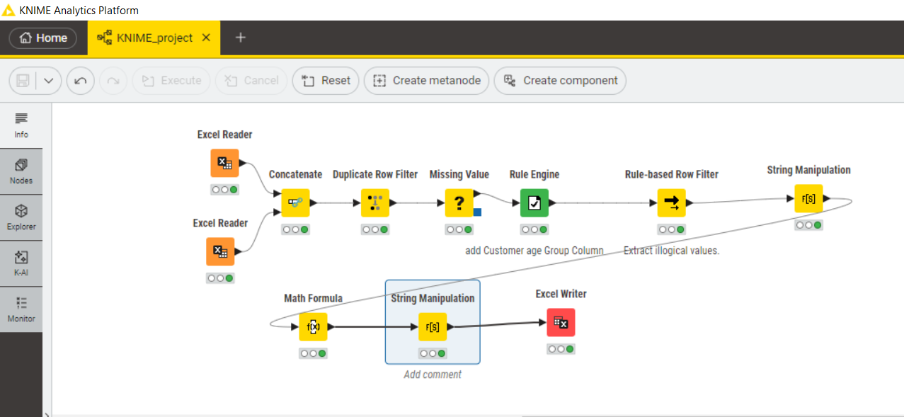

# Connected Business Performance Reporting System -PowerBI project-

## Project Overview
This project involves building a **connected reporting system** to analyze business performance using data from **multiple sources**.  
It integrates **ETL processes**, **data modeling**, and **interactive dashboards in Power BI** to provide insights into sales, customer behavior, profitability, and more.

## Project Scope
**Key Reports Include:**
- Sales performance
- Customer behavior
- Product trends
- Profitability (by category, location, or payment method)
- Store comparison analysis

## Data Sources
The project uses two files:
- `UAEEmart.xlsx`
- `JordanEmart.xlsx`
  
## ETL Process (KNIME)
### ETL Steps:
**1. Extract**
- Pull data from:
  - Excel sheets

**2. Transform**
- Standardize date and number formats
- Handle missing/duplicate values
- Create calculated fields (e.g., Profit Margin, Customer Age Group)
- Join tables using keys like `ProductID`, `CustomerID`

**3. Load**
- Store the clean data into excel sheet
  

## Power BI Data Modeling
- Imported excel sheet into Power BI
- Created calculated columns and DAX measures for:
  - Total Sales
  - Profit Margin
  - Average Order Value
  - Sales by Region and Category
## Reports & Dashboards

Created interactive Power BI reports
All reports support **slicers**, **drill-down**, and **tooltips** for interactivity.

## Dashboard Preview

