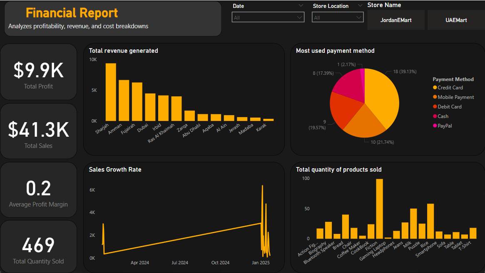
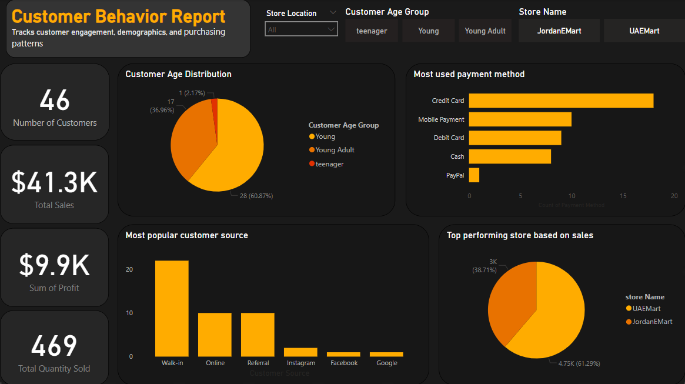
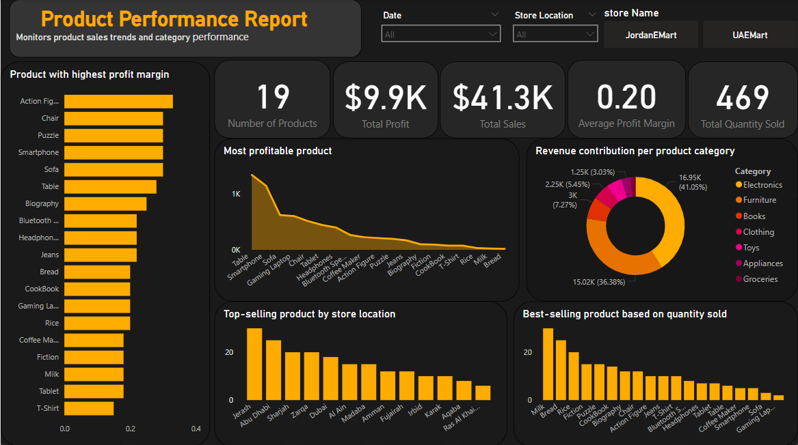

# Connected Business Performance Reporting System -PowerBI project-

## Project Overview
This project involves building a **connected reporting system** to analyze business performance using data from **multiple sources**.  
It integrates **ETL processes**, **data modeling**, and **interactive dashboards in Power BI** to provide insights into sales, customer behavior, profitability, and more.

## Project Scope
**Goal:** Create a unified reporting environment using structured and cleaned data from different sources.  
**Key Reports Include:**
- Sales performance
- Customer behavior
- Product trends
- Profitability (by category, location, or payment method)
- Store comparison analysis

## Data Sources
The project uses **Two interconnected data sources**, such as:
- `Sales.csv` (or Excel): Transactional sales data
- `Customers.xlsx`: Customer profiles
- `Products.db` (SQLite): Product and inventory details

## ETL Process (Using Free ETL Tool)
**Tool Used:** `Talend Open Studio` / `KNIME` / `Apache Nifi` (choose one)

### 🔄 ETL Steps:
**1. Extract**
- Pull data from:
  - CSV files
  - Excel sheets
  - SQLite database

**2. Transform**
- Standardize date and number formats
- Handle missing/duplicate values
- Create calculated fields (e.g., Profit Margin, Customer Age Group)
- Join tables using keys like `ProductID`, `CustomerID`

**3. Load**
- Store the clean, transformed data into:
  - A central SQLite database
  - Or separate files for direct import into Power BI

📸 Screenshots and ETL documentation are available in the `/ETL_Process` folder.

## Power BI Data Modeling
- Imported all cleaned tables into Power BI
- Defined relationships using:
  - `Product ID`
  - `Customer ID`
- Created calculated columns and DAX measures for:
  - Total Sales
  - Profit Margin
  - Average Order Value
  - Sales by Region and Category

## Reports & Dashboards

Created interactive Power BI reports for:

| Report Name             | Description |
|-------------------------|-------------|
| Sales Dashboard         | KPIs, trends, filters by time/location |
| Customer Insights       | Top customers, demographics, AOV |
| Product Performance     | Bestsellers, low-performers |
| Profitability Analysis  | By category, region, payment method |
| Store Comparison        | Multi-store performance breakdown |

All reports support **slicers**, **drill-down**, and **tooltips** for interactivity.
## Dashboard Preview

